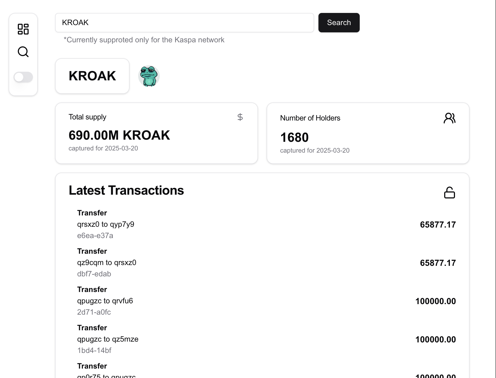

# Project Name
> A modern, simple, and functional Kaspa Token Explorer 
> Live demo link [_here_]soon(soon).

## Table of Contents
* [General Info](#general-information)
* [Technologies Used](#technologies-used)
* [Features](#features)
* [Screenshots](#screenshots)
* [Setup](#setup)
* [Areas for Improvement](#areas-for-improvement)

## General Information
- This project intends to solve searching and monitoring tokens issue for Kaspa L1

## Technologies Used
- Next.js
- TanStackQuery
- shadcn
- Tailwind CSS

## Features
List the ready features here:
- Search for existing tokens by Ticker
- Enjoy crucial data including Transactions
- Share link for already found tokens with friends
- Mobile friendly!
- Dark mode available

## Screenshots

## Setup
Make sure that you've Node > 20
`pnpm install --force` or `pnpm install --legacy-peer-deps` to fetch necessary deps as we use `Next.js === 15.1`

Open [http://localhost:3000](http://localhost:3000) with your browser to see the result.

- [Next.js Documentation](https://nextjs.org/docs) - learn about Next.js features and API.
- [Learn Next.js](https://nextjs.org/learn) - an interactive Next.js tutorial.

use `npm run deploy` for deployment to Cloudflare

## Areas for Improvement

Areas for improvement:
- Error state handling
- Add more data on fetched tokens
- Add attractive banners with top tokens, latest tokens, popular pairs etc. that can improve user impression

